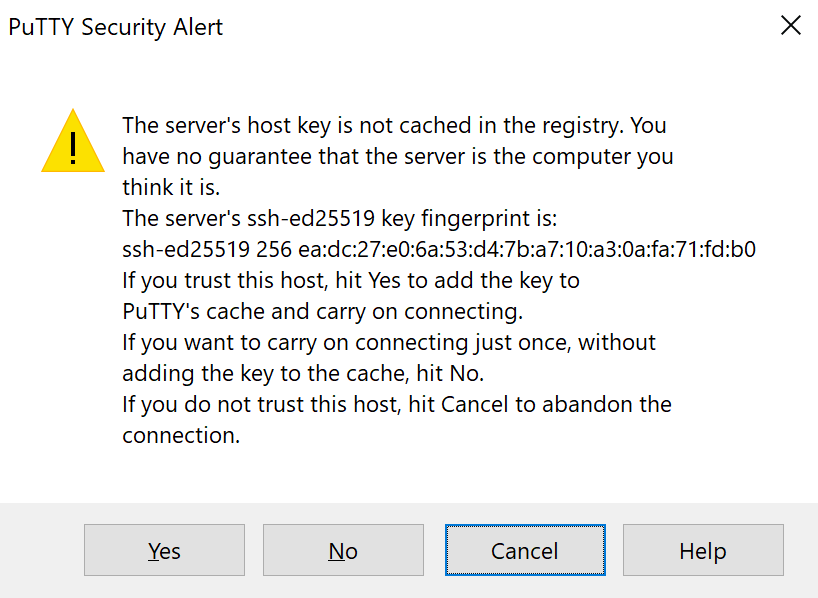

# POC Scenario 2: Linux On Azure 101

## Table of Contents
* [Abstract](#abstract)
* [Learning objectives](#learning-objectives)
* [Prerequisites](#prerequisites)
* [Linux Distribution](#linux-distribution)
* [Estimated time to complete this module](#estimated-time-to-complete-this-module)
* [Connect to the Virtual Machine](#customize-your-azure-portal)
* [Virtual Machine Creation](#virtual-machine-creation)
* [Connect to the Virtual Machine](#connect-to-the-virtual-machine)
* [Install MariaDB and Galera Cluster](#Install-MariaDB-and-Galera-Cluster)
* [Load Balancer Creation](#load-balancer-creation)
* [Add the VMs to Load Balancer](#add-the-vms-to-load-balancer)
* [Create the load balancing rule for MYSQL](#create-the-load-balancing-rule-for-mysql)
* [Add data disk to Web Servers](#add-data-disk-to-web-servers)
* [Configure Gluster Storage Replication](#configure-gluster-storage-replication)
* [Reconfigure Apache](#reconfigure-apache)
* [Prepare Wordpress Installation](#prepare-wordpress-installation)
* [Install Wordpress](#install-wordpress)
* [Testing](#testing)


# Abstract
During this module, you will learn about using the Linux operating system in Azure and performing some basic operational task in this type of environment.


# Learning objectives
After completing the exercises in this module, you will be able to the following basic operations in Linux:
* Using azure cli
* Monitoring Linux
* Patch management
* Adding a disk
* Using disk encryption


# Prerequisites 
* Complete the "Deploying Website on Azure IaaS VMs (Red Hat Enterprise Linux) - HTTP" as this scenario starts from the completed infrastructure configured on that PoC

[Deploying Website on Azure IaaS VMs (Red Hat Enterprise Linux)](https://github.com/Azure/fta-azurefundamentals/blob/master/iaas-fundamentals/articles/website-on-iaas-http-rhel.md)

# Linux Distribution
* This PoC release is based on the Red Hat Enterprise Linux OS and is expected to work on any distribution of the Red Hat Family. 


# Estimated time to complete this module
1.5 hour


# Connect to The Virtual Machine

* For Windows download [SSH Putty client](https://www.chiark.greenend.org.uk/~sgtatham/putty/latest.html)

* Open an instance of the putty client and connect to one of the machines (only one machine will be used)


* Click "Yes" on the putty security alert


* For Linux or Mac just use the ssh command from the terminal
```bash
ssh azureadmin@<public ip address>
```


# Azure ClI
* Install Azure CLI for linux:
[Install Azure CLI using Yum](https://docs.microsoft.com/en-us/cli/azure/install-azure-cli?view=azure-cli-latest#install-with-yum-package-manager)

* Connect to your Azure subscription:
[Log in with Azure CLI 2.0](https://docs.microsoft.com/en-us/cli/azure/authenticate-azure-cli?view=azure-cli-latest)

# Monitoring Linux with Boot Diagnostics
* Enable Boot Diagnostics either by using the Azure CLI or the Portal:
[Enable Boot Diagnostics using CLI] (https://docs.microsoft.com/en-us/azure/virtual-machines/linux/tutorial-monitoring#enable-boot-diagnostics)

[Enable Boot Diagnostics using the Portal] (https://docs.microsoft.com/en-us/azure/virtual-machines/linux/boot-diagnostics)

* View Boot Diagnostics by using the CLI
[Enable Boot Diagnostics using CLI] (https://docs.microsoft.com/en-us/azure/virtual-machines/linux/tutorial-monitoring#enable-boot-diagnostics)

* Navigate in the Azure Portal, go to the Virtual Machine, select the "Boot Diagnostics" oprtion and view the same information.

# Monitoring Linux with host metrics
* View the host metrics in the Azure Portal
[View Host Metrics](https://docs.microsoft.com/en-us/azure/virtual-machines/linux/tutorial-monitoring#view-host-metrics)

# Update Management
* Configure update management in Linux:
[Manage Package Updates](https://docs.microsoft.com/en-us/azure/virtual-machines/linux/tutorial-monitoring#manage-package-updates) 

# Adding a Disk
* Add a new disk to the linux machine.
[Add a disk to a Linux VM](https://docs.microsoft.com/en-us/azure/virtual-machines/linux/add-disk)

* Mount the disk in linux
[Mount disk](https://docs.microsoft.com/en-us/azure/virtual-machines/linux/add-disk#connect-to-the-linux-vm-to-mount-the-new-disk)

> Note: follow the procedure until the fstab configuration. Do not continue to "TRIM/UNMAP support for Linux in Azure"

# Using Disk Encryption
* Via Azure CLI, create an Azure Key Vault and a key:
[Create Azure Key Vault and keys](https://docs.microsoft.com/en-us/azure/virtual-machines/linux/encrypt-disks#create-azure-key-vault-and-keys)

* Create a service principal in Azure AD:
[Create the Azure Active Directory service principal](https://docs.microsoft.com/en-us/azure/virtual-machines/linux/encrypt-disks#create-the-azure-active-directory-service-principal)

* Encrypt the linux virtual machine
[Encrypt Virtual Machine](https://docs.microsoft.com/en-us/azure/virtual-machines/linux/encrypt-disks#encrypt-virtual-machine)