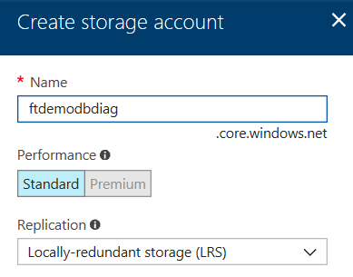
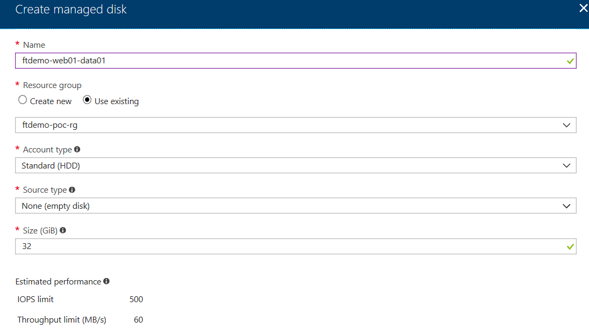

# POC Scenario 1: Deploying Wordpress on Azure IaaS VMs (Red Hat Enterprise Linux) - HTTP

## Table of Contents
* [Abstract](#abstract)
* [Learning objectives](#learning-objectives)
* [Prerequisites](#prerequisites)
* [Estimated time to complete this module](#estimated-time-to-complete-this-module)
* [Customize your Azure Portal](#customize-your-azure-portal)
* [Resource Group creation](#resource-group-creation)
* [Virtual Network Creation](#virtual-network-creation)
* [Virtual Machine Creation](#virtual-machine-creation)
* [Connect to the Virtual Machine](#connect-to-the-virtual-machine)
* [Install HTTPD on the VMs](#install-httpd-on-the-vms)
* [Load Balancer Creation](#load-balancer-creation)
* [Add the VMs to Load Balancer](#add-the-vms-to-load-balancer)
* [Create the load balancing rule for HTTP](#create-the-load-balancing-rule-for-http)
* [Update the NSG (inbound security rule)](#update-the-nsg-inbound-security-rule)
* [Assign DNS name to Load Balancer](#assign-dns-name-to-load-balancer)
* [Testing](#testing)
* [Automation Scripts (ARM Template)](#automation-scripts-arm-template)
* [Visualize your Architecture with ArmViz](#visualize-your-architecture-with-armviz)


# Abstract

During this module, you will learn about bringing together all the infrastructure components to build a Wordpress Website running on Linux and making it scalable, highly available and secure.


# Learning objectives
After completing the exercises in this module, you will be able to:
* TBD

# Prerequisites 
* Complete the "Deploying Website on Azure IaaS VMs (Red Hat Enterprise Linux) - HTTP" as this scenario starts from the completed infrastructure configured on that PoC

[Deploying Website on Azure IaaS VMs (Red Hat Enterprise Linux)](https://tbd/)


# Estimated time to complete this module
1 hour

# Virtual Machine Creation
  * Create 2 VMs for the database
  * Select from the marketplace, **Red Hat Enterprise Linux 7.3**
  * Name the 1st VM **(prefix)-db01-vm**
  * Name the 2nd VM **(prefix)-db02-vm**
  * Make sure to choose **HDD disk**
  * Choose password Authentication Type and make sure the user name is in lowercase only

    

  * For the size select **D1_V2**
  
  * Create an availability set named **(prefix)-db-as**
  > Note: During the 2nd VM creation pick the previously created Availability set  
  * Below Storage select **Yes** to **Use managed disks**
  * Select the previously create Virtual Network and the Web subnet
  
    

  * Create a Diagnostics Storage account named **(prefix)dbdiag**

   

  * After the Virtual machines are created, take note of the Public IP address for each Virtual Machine:

    

# Connect to The Virtual Machine

* For Windows download [SSH Putty client](https://www.chiark.greenend.org.uk/~sgtatham/putty/latest.html)

* Open two instances of the putty client and connect to the servers

 

* Click "Yes" on the putty security alert
 

* For Linux or Mac just use the ssh command from the terminal
```bash
ssh azureadmin@<public ip address>
```
 

# Install MariaDB and Galera Cluster on the VMs
From the SSH terminal, execute the following instructions on both servers.

  * Elevate privileges to root
  ```bash
  sudo su -
  ```

  * Install MariaDB and Galera Cluster
  ```bash
  yum install rh-mariadb101-mariadb-server-galera 
  ```

  * Install elinks terminal browser for testing
  ```bash
  yum install elinks
  ```

 * Open Galera configuration file
  ```bash
  nano /etc/opt/rh/rh-mariadb101/my.cnf.d/galera.cnf
  ```

 * Change wsrep_cluster_address with the Database Server IPs
  ```bash
  wsrep_cluster_address="gcomm://10.0.1.4,10.0.1.5"
  ```

 * Enable MariaDb service
  ```bash
 scl enable rh-mariadb101 galera_new_cluster
  ```

 * Start MariaDB service
  ```bash
  systemctl start rh-mariadb101-mariadb.service
  ```  

 * Create Firewall exceptions:
  ```bash
 firewall-cmd --zone=public --add-port=3306/tcp --permanent
firewall-cmd --zone=public --add-port=4567/tcp --permanent
firewall-cmd --zone=public --add-port=4568/tcp --permanent
firewall-cmd --zone=public --add-port=4444/tcp --permanent
firewall-cmd --reload
  ``` 

 * Open mysql locally (first server only)
 ```bash
 mysql
 ```

* Change root default password
```sql
SET PASSWORD FOR 'root'@'localhost' = PASSWORD('<New Password>');
```

* Create a new user for remote connection and grand privileges
```sql
CREATE USER 'ftdemodbuser'@'%' IDENTIFIED BY '<New Password>';
GRANT ALL PRIVILEGES ON *.* TO 'maria'@'%' WITH GRANT OPTION;
```

# Load Balancer Creation (ongoing)
  * From the left panel on the Azure Portal, select **Load balancers**.
  * Click on **Add**
  * Name: **(prefix)-db-lb**
  * Click **Public IP Address**, click **New**
  * Enter name **(prefix)-web-pip**, click **Ok**

     

  * Select **Use Existing** for **Resource Group**, i.e. **(prefix)-poc-rg**, click **Create**

     

  * After the **Load Balancer** is created, select the one you added.

     

  * Under **Settings** select **Health probes**, click **Add**.
  * Enter name **(prefix)-web-prob**, leaving all the defaults, click **Ok**

   

# Add the VMs to Load Balancer
  * Under **Settings** select **Backend pools**, click **Add**.
  * Enter name **(prefix)-web-pool**.
  * For **Associated to**, select **Availability set**.
  * For the **Availability set**, select **(prefix)-web-as**.
  * Click **Add a target network IP configuration** to add the first web server and its IP address.

   

  * **Repeat** the step above to also add the IP configuration for the second web server.
  * Click **OK**.

# Create the load balancing rule for HTTP (ongoing)
  * Under **Settings** select **Load balancing rules**, click **Add**.
  * Enter name **(prefix)-http-lbr**.
    *  Protocol: **TCP**
    *  Port: **80**
    *  Backend port: 80
    *  Backend pool: **(prefix)-web-pool(2VMs)**
    *  Probe: **(prefix)-web-prob(HTTP:80)**
    *  Session Persistence: **None**
    *  Idle timeout (min):**4**
    *  Floating IP (direct server return): **Disabled**
    *  Click **Ok**

   


# Update the NSG (inbound security rule) (ongoing)
## Virtual machine #1
  * From the left panel on the Azure Portal, select **Virtual machines**, then select **(prefix)-web01-vm**.
  * Under **Settings** select **Network Interfaces** 
  * Click on **(prefix)-web01-vm-nsg**.
  * Under **Settings** select **Network Security Groups**.
  * Under **Network Security Group**, click on **(prefix)-web01-vm-nsg**.

   

  * Under **Settings**, click on **Inbound Security Rules**.
  * Click **Add**, Enter name **(prefix)-web01-vm-nsgr-http-allow**
    *  Priority:**1010**
    *  Source: **any**
    *  Service: **HTTP**
    *  Protocol: **TCP**
    *  Port range: **80**
    *  Action: **Allow**

   


## Virtual machine #2 (ongoing)
  * From the left panel on the Azure Portal, select **Virtual machines**, then select **(prefix)-web02-vm**.
  * Under **Settings** select **Network Interfaces** 
  * Click on **(prefix)-web02-vm-nsg**.
  * Under **Settings** select **Network Security Groups**.

  

  * Click on **(prefix)-web02-vm-nsg**.
  * Under **Settings**, click on **Inbound Security Rules**.
  * Click **Add**, Enter name **(prefix)-web02-vm-nsgr-http-allow**
    *  Priority:**1010**
    *  Source: **any**
    *  Service: **HTTP**
    *  Protocol: **TCP**
    *  Port range: **80**
    *  Action: **Allow**

   


 # Add data disk to Web Servers
  * Open the Azure Portal
  * Select the First Web Server
  * Select Disks
  * Select "+Add Data Disks"
  * Create a new Managed Disk with 32 Gb with Standard tier

  

  * Connect to the server via SSH
  * Initialize the data disk using the following procedure: [Initialize Data Disk](https://docs.microsoft.com/en-us/azure/virtual-machines/linux/classic/attach-disk#initialize-a-new-data-disk-in-linux)

  * You can mount the new disk in /datadrive
  * Repeat the steps in the second server

# Configure Gluster Storage Replication

TBD

# Configure Storage Replication

TBD

# Reconfigure Apache

* Install additional packages for apache
```bash
yum install php php-common php-mysql php-gd php-xml php-mbstring php-mcrypt
```

mkdir /var/www/ftdemo

TBD

# Install Wordpress

* Download the latest version of Wordpress and copy contents to the final location
```bash
cd /tmp
wget http://wordpress.org/latest.tar.gz
tar xzf latest.tar.gz
mv wordpress/* /var/www/ftdemo
```
* Open the wordpress configuration file
```
cd /var/www/ftdemo
cp wp-config-sample.php wp-config.php
nano wp-config.php
```

* Change the mysql settings. 
// ** MySQL settings - You can get this info from your web host ** //
/** The name of the database for WordPress */
define('DB_NAME', 'ftademo');
/** MySQL database username */
define('DB_USER', 'ftademodbuser');
/** MySQL database password */
define('DB_PASSWORD', '<Password>');
/** MySQL hostname */
define('DB_HOST', '<Azure Internal Load Balancer IP>');


# Testing 
  * Browse to the load balancer public IP or **http://(prefix).westus2.cloudapp.azure.com/**
  * You will see the Web server default page showing either Web Server 01 or 02.
  * If you see Web Server 01, then SSH into VM1, stop the httpd server
  ```bash
  systemctl stop httpd.service
  ```
  * Refresh the web page, you will see Web Server 02. The Load balancer detects VM1 is down and redirects traffic to VM2.

   


